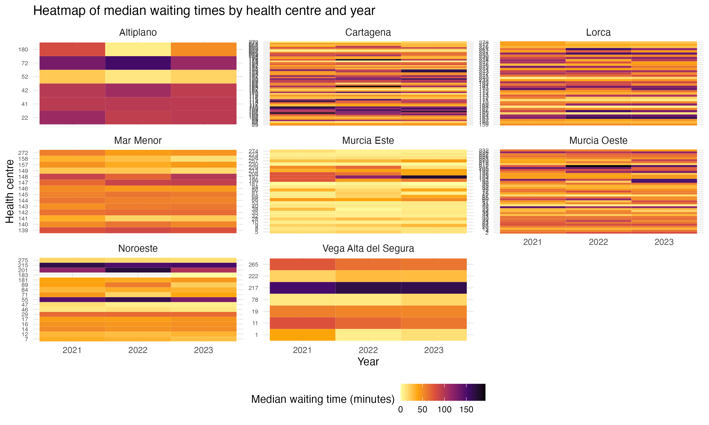
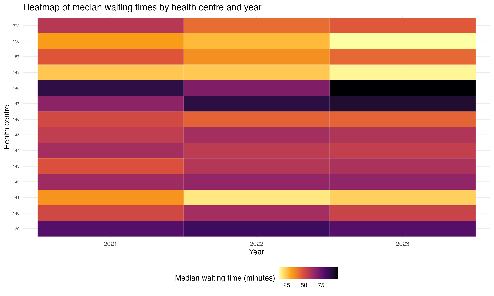
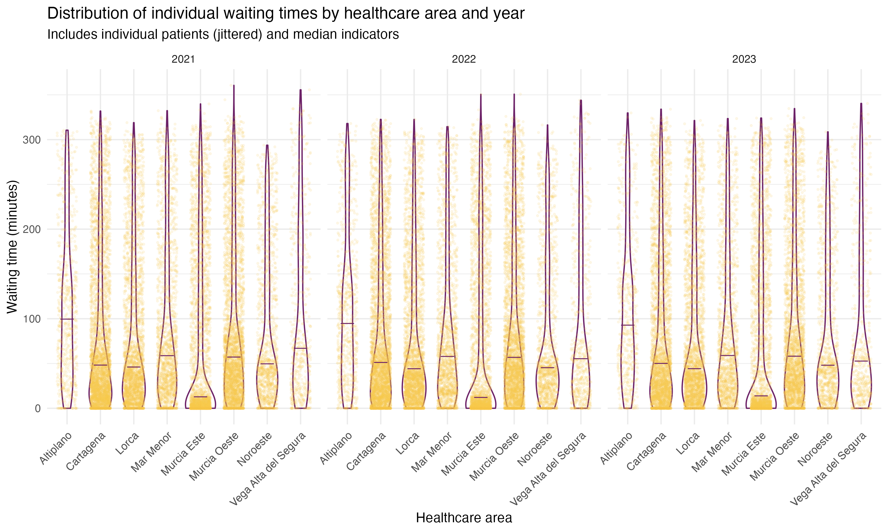
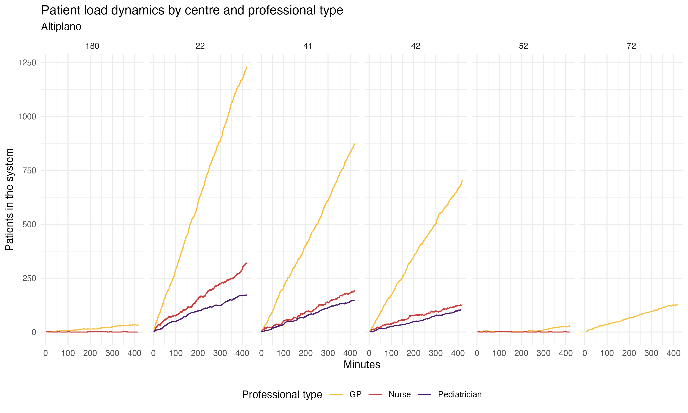

---
output:
  pdf_document:
    latex_engine: xelatex
  html_document: default
---

## Introduction

La Atención Primaria (AP) es uno de los pilares de un sistema sanitario robusto. Desempeña un papel clave en la prevención de enfermedades, gestión de la cronicidad y ejerce como gatekeeper, trabajando como puerta de entrada y modulador de la demanda.

[Incluir atención primaria como gatekeeper]
[Incluir plan estratégico de atención primaria]
...

En España, la sanidad representa la segunda política pública más relevante en términos de gasto, siendo ejecutada en gran medida por las comunidades autónomas. Esta distribución subraya la importancia de una gestión eficiente para maximizar los beneficios derivados de esta política pública. Según la última edición de la Estadística del Gasto Sanitario Público, correspondiente a 2022, el gasto en sanidad pública en España alcanzó los 92.072 millones de euros, de los cuales 84.206 millones fueron gestionados por las comunidades autónomas.

En la Región de Murcia, el gasto sanitario público total ha experimentado un crecimiento continuado desde 2002, con la única excepción del periodo 2011-2014. Tanto en términos per cápita como en porcentaje del PIB, el gasto murciano se sitúa por encima de la media nacional. En 2022, se registró la cifra más alta de la serie, con un gasto total de 3.020 millones de euros, lo que representa un incremento acumulado del 200 % respecto al año 2002 (equivalente a un 5,6 % anual). Medido en términos per cápita, el gasto por habitante en Murcia ascendió a 1.987 euros en 2022, superando la media nacional desde 2008. Asimismo, el gasto público en porcentaje del PIB en Murcia se mantuvo por encima de la media nacional, representando el 8,1 % en la Región de Murcia frente al 6,2 % de media nacional en 2022. El máximo histórico para la región de Murcia se alcanzó en 2020 con un 8,8 % del PIB, como consecuencia directa de la crisis sanitaria de la COVID-19. 

El Servicio Murciano de Salud se enfrenta a desafíos como son la creciente carga asistencial, la presión constante sobre los recursos humanos y la necesidad de optimizar los tiempos de atención que garanticen una cobertura efectiva y de calidad. Estos retos señalan la necesidad de explorar herramientas analíticas innovadoras para analizar las dinámicas demográficas y de atención, que permitan mejorar la eficiencia del servicio de salud.

[Incluir DEA] En economía de la salud se estudia la eficiencia de los sistemas desde un enfoque de función de producción, que tiende a simplificar la realidad con el fin de hacer las aproximaciones computacionalmente manejables. 

Simulation can be defined as designing a model of a real system and conducting experiments with this model for the purpose either of understanding the behavior of the system or evaluating various strategies. The great advantage of a simulation model is that it allows us to generate data, i.e. to generate an alternative reality and to come up with what-if scenarios.Specifically, discrete event simulation (DES) is a type of patient-level simulation that tracks individual patients and their associated events over time, accounting for the randomness of patient characteristics and clinical events. It allows for greater flexibility in modeling individual patient pathways and capturing the variability that may be overlooked by traditional deterministic models (3,4). 

El objetivo principal de este trabajo es la construcción de un modelo de simulación basado en datos reales que analice los flujos de pacientes en consultas de Atención Primaria en la Comunidad Autónoma de la Región de Murcia, que ayude a formular propuestas para la toma de decisiones estratégica. Para ello, se establecen los siguientes objetivos específicos:
- Modelizar las llegadas de pacientes e interacciones entre los pacientes y los diferentes recursos sanitarios (profesionales de diferentes tipos) de AP considerando sus características demográficas (sexo, edad).
- Extraer las métricas clave del sistema, como los tiempos de espera de los pacientes, utilización de recursos e identificación de cuellos de botella.
- Evaluar el impacto de intervenciones, comparando el rendimiento del sistema bajo diferentes supuestos: variación del número de profesionales, redistribución de la demanda o promoción de otras modalidades de consulta (teleconsulta).

# Metodología

Para analizar el impacto de distintos escenarios organizativos sobre la atención primaria en la Región de Murcia, se desarrolló un modelo de simulación de eventos discretos (DES) implementado en R mediante el paquete `simmer`. Este enfoque permite modelar el flujo de pacientes a través del sistema sanitario, considerando restricciones reales de capacidad, frecuencia de uso, perfiles sociodemográficos y tiempos de atención.

El modelo ha sido diseñado para permitir simulaciones diferenciadas por año, replicando la evolución de la demanda asistencial observada entre 2019 y 2023. Si bien la estructura de recursos sanitarios se ha considerado constante a lo largo del periodo, la variación interanual en la población asignada y en el número de consultas permite capturar dinámicas reales del sistema frente a cambios en la presión asistencial, como los derivados de la pandemia de COVID-19 o del aumento progresivo de la atención no presencial.

## Estructura del modelo de simulación

La interacción entre entidades (pacientes), recursos (profesionales sanitarios) y reglas de enrutamiento (trayectorias asistenciales) se detallan a continuación:

Las **entidades activas** del sistema son los pacientes, definidos por atributos individuales: edad, modalidad de consulta (presencial, telefónica, domiciliaria), tipo de profesional requerido (medicina de familia, pediatría, enfermería) y prioridad asignada. Estos atributos condicionan tanto la trayectoria que siguen dentro del sistema como la duración esperada de su atención.

Los **recursos** corresponden a los profesionales sanitarios disponibles en cada centro de salud. Su capacidad se estima a partir del número de horas semanales disponibles por tipo de profesional, y se transforma en unidades discretas de capacidad sobre la base de jornadas equivalentes de 37,5 horas semanales.

Las **trayectorias** representan la secuencia de eventos por la que transita cada paciente: llegada al sistema, espera en cola en caso de saturación, consulta con el profesional correspondiente y liberación del recurso. La duración de cada consulta se modela como una **variable aleatoria log-normal**:

$$
\text{Duración} \sim \text{LogNormal}(\mu_{\log}, \sigma_{\log}),
\quad \text{donde} \quad \mu_{\log} = \log(\mu) - \frac{1}{2} \sigma^2
$$

Los valores de $\mu$ varían en función de los atributos del paciente y se detallan en la Tabla 1:

**Tabla 1. Duraciones medias esperadas según perfil de paciente y modalidad de consulta**

| Profesional          | Edad del paciente | Modalidad     | $\mu$ (minutos)           |
|----------------------|-------------------|---------------|----------------------------|
| Médico de familia    | < 65 años         | Presencial     | 12                         |
| Médico de familia    | ≥ 65 años         | Presencial     | 17                         |
| Pediatra             | < 1 año           | Presencial     | 17                         |
| Cualquier            | —                 | Telefónica     | $\max(2, \mu - 5)$         |
| Cualquier            | —                 | Domiciliaria   | $2 \times \mu$             |

Las llegadas de pacientes se generan de acuerdo con un proceso de Poisson homogéneo, lo cual implica que los pacientes llegan al sistema de forma independiente entre sí y con una tasa constante dentro de la jornada simulada. Para cada combinación de edad, tipo de profesional y modalidad, se estima una tasa de llegada $\lambda$ a partir de las tasas de frecuentación observadas en los datos del SIAP. Posteriormente, se simulan las llegadas como una serie de tiempos de arribo distribuidos exponencialmente entre pacientes consecutivos:

$$
\text{Interarribo} \sim \text{Exponential}(\lambda)
$$

Dado que el paquete `simmer` permite incorporar directamente tiempos concretos mediante la función `at()`, las llegadas generadas con base Poisson se precalculan y se introducen en el modelo como eventos programados. Esta aproximación garantiza que el proceso de llegada siga una distribución estadísticamente coherente con un flujo de Poisson, pero con la flexibilidad computacional de un calendario explícito de eventos.

La ejecución del modelo se realiza sobre un intervalo temporal equivalente a una jornada laboral estándar de 420 minutos (7 horas), lo que permite analizar dinámicas intra-diarias como saturación de recursos, tiempos de espera y capacidad ociosa. Para cada configuración, el modelo puede ser replicado múltiples veces con diferentes semillas aleatorias para evaluar la estabilidad de los resultados y realizar análisis de sensibilidad.

## Datos y análisis

La parametrización del modelo se basó en una combinación de fuentes oficiales y datos extraídos mediante técnicas automatizadas. La principal fuente de información para la caracterización de la demanda asistencial fue el **Sistema de Información de Atención Primaria (SIAP)**, gestionado por el Ministerio de Sanidad. Este sistema proporciona datos homogéneos a nivel nacional sobre los principales indicadores de atención primaria, con desagregación por comunidad autónoma y por área de salud.

Para este trabajo se utilizaron las series históricas disponibles entre **2019 y 2023**, lo que permitió construir un conjunto de simulaciones interanuales que incorporan los cambios observados en la actividad asistencial a lo largo del tiempo. En concreto, se emplearon datos de la **población asignada** a cada área sanitaria de la Región de Murcia, desagregada por grupo de edad quinquenal y sexo, así como el número total de **consultas atendidas por tipo de profesional** (medicina de familia, pediatría, enfermería) y por modalidad (presencial, telefónica, domiciliaria) para cada año del periodo analizado.

En concreto, se utilizó información sobre la población asignada a cada área sanitaria de la Región de Murcia, desagregada por grupo de edad quinquenal y sexo, así como datos sobre el volumen de consultas atendidas en los centros de atención primaria durante el año 2022, diferenciando por tipo de profesional (medicina de familia, pediatría, enfermería) y modalidad de atención (presencial, telefónica y domiciliaria). Estos datos permitieron calcular tasas de frecuentación ajustadas por edad y sexo, y estimar la demanda asistencial en cada área.

Dado que el SIAP no proporciona información a nivel de centro de salud, se desarrolló un procedimiento adicional para estimar la distribución de recursos asistenciales por centro dentro de cada área. Para ello, se realizó una recopilación sistemática de datos desde el portal institucional MurciaSalud.es mediante técnicas de web scraping, que permitió identificar la plantilla de profesionales sanitarios adscritos a cada centro de salud (médicos de familia, pediatras y personal de enfermería), así como su horario en formato libre.

Esta información fue transformada y normalizada mediante la función week_hours(), que utiliza expresiones regulaes para extraer y estimar el número de horas semanales efectivas de atención por profesional. Los casos con información incompleta o ilegible por parte de la función se imputaron de manera conservadora:
	1.	En primer lugar, para aquellos profesionales cuyo horario era ilegible o reportaba cero horas, se imputó el valor medio de horas semanales de los profesionales del mismo centro.
	2.	En segundo lugar, si en un centro determinado no existía ninguna observación válida con la que calcular esa media, se imputó el valor medio de horas semanales del conjunto de profesionales del mismo tipo (médico, pediatra, enfermero/a) en el total de la región.

Posteriormente, para cada tipo de profesional en cada área sanitaria, se calculó el peso relativo de cada centro en función de su volumen total estimado de horas semanales. Estos pesos se utilizaron para repartir proporcionalmente la actividad asistencial observada en los datos del SIAP, que están disponibles únicamente a nivel de área, entre los distintos centros de salud pertenecientes a esa área.

Finalmente, el conjunto de datos resultante permitió integrar, por un lado, la estructura poblacional, los patrones de frecuentación y la capacidad efectiva de atención disponible en cada centro. A partir de esta base consolidada se generaron llegadas aleatorias de pacientes al sistema, cuyas tasas fueron calibradas para reproducir la demanda observada, ajustada por edad, área de residencia y modalidad de consulta. 

# Results

The discrete event simulation model was executed for a standard working day in primary care, under configurations derived from empirical data spanning 2021 to 2023. Patient-level parameters were generated based on real observed distributions from the SIAP administrative database, whereas the availability of health professionals was reconstructed from web-scraped rosters for a single reference period. Thus, demand fluctuates year by year in the simulation, but supply remains structurally constant across scenarios. The results presented here draw on the full set of simulated patients and enable detailed analysis by year, health area, centre, age group, and consultation modality.

## Population structure and demand composition

Figure 1 shows the distribution of consultations by care modality across the nine health areas. **In-person visits** remain predominant in all areas, consistently accounting for over 60% of simulated interactions. Nevertheless, the role of **remote consultations**—introduced and expanded during the COVID-19 pandemic—is evident, particularly in urban regions such as Murcia Este, Cartagena and Lorca, where remote care comprises over 30% of encounters. **Home visits**, although marginal, exhibit spatial variation and are more prevalent in rural areas.

Most consultations are concentrated in the working-age population (15–64). However, specific areas such as **Mar Menor** and **Altiplano** show a notable share of consultations in the **paediatric** group, while others such as **Lorca** and **Noroeste** register a higher proportion of **elderly patients**, which may have direct implications for consultation length and clinical complexity (Figure XX).

## Waiting time patterns

The core performance indicator of the simulation is the **waiting time**, defined as the delay between patient arrival and the start of consultation. Figure XX presents a **heatmap of median waiting times by health centre and year**, allowing both temporal and territorial patterns to emerge. The results highlight centres in **Murcia Este, Cartagena, and Lorca** as persistent hotspots, with median waiting times frequently exceeding 100 minutes during 2021 and 2022. 

To better illustrate centre-level variation, Figure 4 zooms in on **Murcia Este**, displaying results for each centre within that area. The analysis confirms a striking heterogeneity: while some centres maintain stable and moderate waiting times, others reach values well above 150 minutes across multiple years (Figure XX). 

At the individual level, the **distribution of waiting times across patients** reveal highly skewed distributions, with long right tails. Although most patients are seen within 100 minutes, a substantial minority experience prolonged delays, especially in 2021 and 2022. These results reflect the system's **increased congestion post-pandemic** (Figure XX).

Figure 6 examines waiting time distribution by **age group**, aggregated by year. Consistent with clinical expectations, **older patients (65+)** experience longer delays. This is attributable to longer average consultation durations and their concentration in more saturated services. Interestingly, the **paediatric group (0–14)** generally records shorter waits, though variability increases in 2023.

## Resource capacity and service saturation

The **relative resource occupation by area and professional type**, measuring the proportion of time each resource is in use. **General practitioners (GPs)** exhibit near-full utilisation across all areas, with values frequently above 90%. This reflects structural overload and limited slack in GP availability. In contrast, **nurses and paediatricians** show more variable—and generally lower—utilisation levels. Areas like **Murcia Este** and **Cartagena** reveal high levels of pressure across all roles, while areas such as **Altiplano** or **Vega Alta del Segura** show more moderate usage, especially for nursing staff.

## Patient load trajectories

To complement the aggregated results presented in Figure 3 regarding relative occupation levels, Figure 4 illustrates the intra-day dynamics of patient load in the health area of **Altiplano**, disaggregated by centre and professional type. Each panel shows the number of patients simultaneously in the system—either being attended or waiting—for general practitioners (GPs), nurses, and paediatricians across the simulated working day.

The results reveal a **marked contrast** between centres. Centres such as **22, 41, and 42** show a sustained accumulation of patients under the GP category, with steep, uninterrupted increases over the simulated period. These centres appear to lack the staffing needed to absorb the simulated demand effectively. In contrast, **centres 52 and 72** display relatively flat or slowly increasing GP load trajectories, indicating **adequate staffing levels and efficient patient flow resolution** under the simulated configuration. 

Across all centres, the **patient load associated with nurses and paediatricians** remains consistently low and stable throughout the simulation. 

Although this analysis is presented for Altiplano, the same approach can be applied to **any health area** to assess centre-level congestion and system responsiveness dynamically.

# Discussion

El modelo desarrollado en este trabajo se concibe como una herramienta de representación funcional del sistema de atención primaria. Se ha construido a partir de datos reales y asunciones empíricamente fundamentadas, con el objetivo de reproducir de forma verosímil el comportamiento dinámico del sistema asistencial en condiciones normales de operación. A diferencia de enfoques comparativos entre políticas o configuraciones alternativas, este modelo busca representar el estado base del sistema y ofrecer un entorno flexible desde el cual se puedan plantear posteriormente escenarios de simulación con fines analíticos, prospectivos o de apoyo a la toma de decisiones.

La integración de datos demográficos, tasas empíricas de frecuentación, estructuras de personal y variabilidad estocástica en los tiempos de consulta permite al modelo generar resultados coherentes con la experiencia observada en el sistema real. Entre las métricas clave que pueden obtenerse a partir de la simulación son la distribución de tiempos de espera por tipo de paciente, la utilización de recursos sanitarios por centro y modalidad, identificar cuellos de botella en la atención y recursos ociosos o saturados.

En este sentido, el modelo puede actuar como una plataforma de simulación extensible para explorar preguntas de evaluación y de apoyo a la toma de decisiones como qué impacto tendría una resdistribución de recursos humanos entre centros, cómo varían los tiempos de espera ante incrementos en la demananda o qué combinaciones de capacidad producen niveles críticos de congestión. Estas preguntas están fuera del alcance del presente trabajo, pero encuentran en este modelo una base sólida para ser abordadas en futuras investigaciones, tanto desde la óptica de la planificación sanitaria como de la evaluación de políticas públicas.

\pagebreak

# Annex

### Software y reproducibilidad

El modelo de simulación desarrollado y el análisis de resultados se ha llevado a cabo utilizando el entorno de programación R, versión 4.x.x. Los paquetes principales utilizados incluyen:

simmer: paquete principal para la simulación de eventos discretos.
simmer.plot: para la visualización de los resultados de la simulación.
tidyverse: colección de paquetes que facilitan la manipulación, transformación y visualización de datos.

Para garantizar la reproducibilidad de este trabajo, todo el código fuente, los scripts de análisis y los datos utilizados para la parametrización del modelo se encuentran disponibles en un repositorio público de GitHub [insertar URL]. 